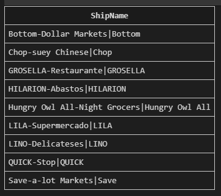
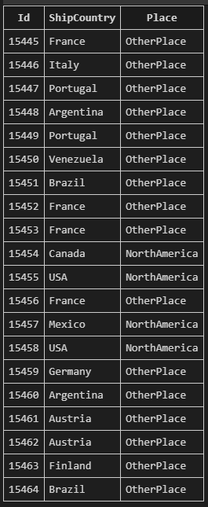
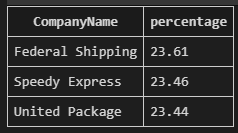
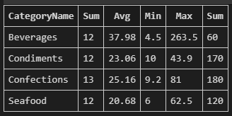
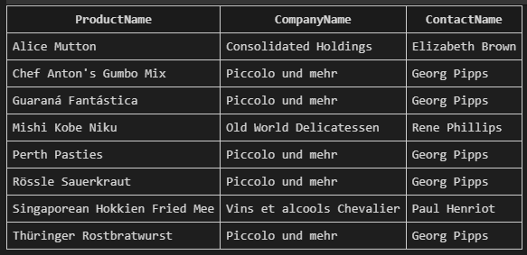
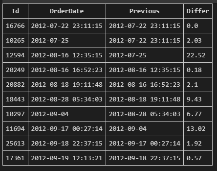
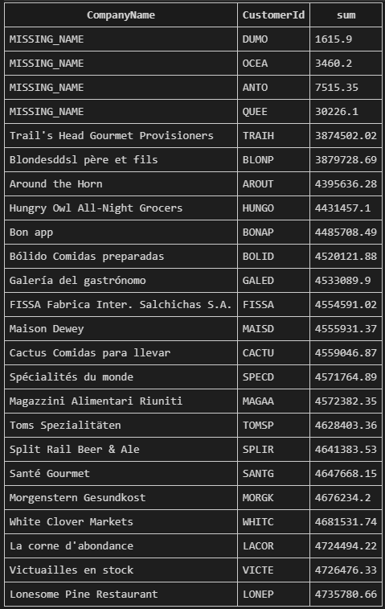
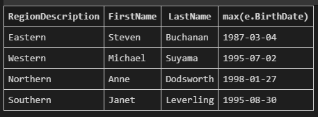

# DataBase Homework 1
# Q1
```sql
SELECT DISTINCT ShipName||'|'||substr(ShipName,1,instr(ShipName,'-')-1) as ShipName
FROM `Order`
WHERE ShipName LIKE '%-%'
ORDER BY ShipName;
```
  
# Q2
```sql
SELECT Id,ShipCountry,CASE ShipCountry 
    when 'USA' then 'NorthAmerica' 
    when 'Canada' then 'NorthAmerica' 
    when 'Mexico' then 'NorthAmerica' 
    else 'OtherPlace' end as Place
FROM `Order`
WHERE Id>=15445
LIMIT 20
```
  
# Q3
```sql
SELECT D.CompanyName,round(CAST(delay as float)/CAST(sum as float)*100,2) as percentage
FROM(
    SELECT  o.ShipVia as Id,count(*) as sum
    FROM `Order` o
    GROUP BY o.ShipVia
) S ,(
    SELECT s.Id,count(*) as delay,s.CompanyName
    FROM `Order` o,Shipper s
    WHERE o.ShippedDate>o.RequiredDate and o.ShipVia=s.Id
    GROUP BY s.Id
) D
WHERE S.Id=D.Id
Order BY percentage DESC
```
  
# Q4
```sql
SELECT c.CategoryName,
    count(*) as Sum,
    round(avg(UnitPrice),2) as Avg,
    min(UnitPrice) as Min,
    max(UnitPrice) as Max,
    sum(UnitsOnOrder) as Sum
FROM Category c,Product p
WHERE p.CategoryId=c.Id
GROUP BY c.Id
HAVING sum>10
```
  
# Q5
```sql
SELECT ProductName,CompanyName,ContactName
FROM(
    SELECT Distinct total.ProductName,min(total.OrderDate),total.CompanyName,total.ContactName
    FROM(
        SELECT od.OrderId,c.CompanyName,c.ContactName,p.ProductName,p.Id as ProductId,o.OrderDate
        FROM OrderDetail od,`Order` o,Customer c,Product p
        WHERE od.OrderId=o.Id and o.CustomerId=c.Id and od.ProductId=p.id
    ) total,(
        SELECT *
        FROM Product p 
        WHERE p.Discontinued=1
    ) dis
    WHERE total.ProductId=dis.Id
    GROUP BY total.ProductName
)
Order BY ProductName
```
  
# Q6
```sql
SELECT a.Id,a.OrderDate,
lag(OrderDate,1,OrderDate) OVER(Order BY OrderDate) as Previous,
round(julianday((a.OrderDate))-julianday(lag(OrderDate,1,OrderDate) OVER(Order BY OrderDate)),2) as Differ
FROM(
    SELECT o.Id,o.OrderDate
    FROM `Order` o
    WHERE o.CustomerId='BLONP'
    Order BY OrderDate
) a
Order BY OrderDate
LIMIT 10
```
  
# Q7
```sql
with pre as (
    SELECT a.CustomerId,a.sum,NTILE(4) OVER (ORDER BY a.sum) as buckets
    FROM(
        SELECT o.CustomerId,round(sum(od.UnitPrice*od.Quantity),2) as sum
        FROM OrderDetail od,`Order` o
        WHERE od.OrderId=o.Id
        GROUP BY o.CustomerId
        Order BY sum
    ) a
)

SELECT 'MISSING_NAME' as CompanyName,a.CustomerId,a.sum
FROM (SELECT * FROM pre) a
WHERE a.CustomerId not in (select c.id FROM Customer c)

UNION ALL

SELECT ifnull(cus.CompanyName, 'MISSING_NAME') as CompanyName,b.CustomerId,b.sum
FROM((
    SELECT *
    FROM pre
) b, Customer cus)
WHERE b.buckets=1 and b.CustomerId=cus.Id
```
  
# Q8
```sql
SELECT r.RegionDescription,e.FirstName,e.LastName,max(e.BirthDate)
FROM EmployeeTerritory et,Employee e,Territory t,Region r
WHERE et.EmployeeId=e.Id and et.TerritoryId=t.Id and t.RegionId=r.Id
GROUP BY r.Id
```
  
# Q9
```sql
SELECT group_concat(ProductName) as ProductName
FROM(
    SELECT p.ProductName as ProductName
    FROM `Order` o,OrderDetail od,Product p,Customer c
    WHERE od.OrderId=o.Id 
        and od.ProductId=p.Id 
        and o.CustomerId=c.Id 
        and o.OrderDate LIKE '2014-12-25%'
        and c.CompanyName='Queen Cozinha'
    Order BY p.Id
)
```
  
